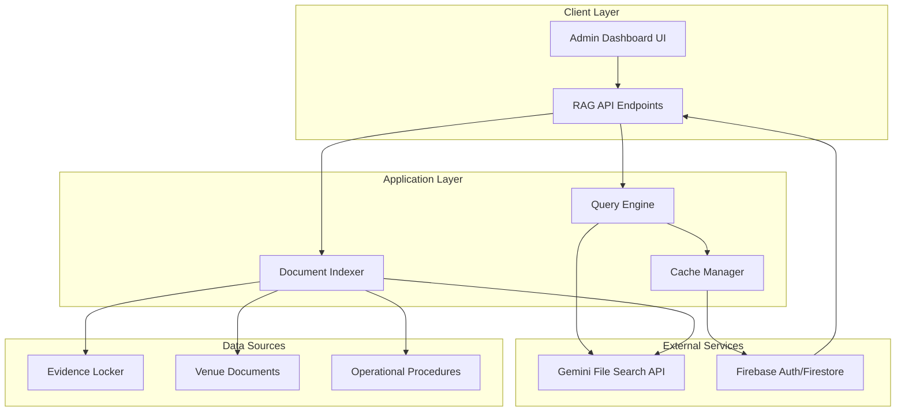

# RAG Integration System Design

## Overview

The RAG Integration System transforms the GettUpp ENT platform into an intelligent operations assistant by implementing Google's Gemini File Search API for contextual document retrieval and natural language query processing. This system indexes the "Evidence Locker" of operational documents and provides instant answers to venue-specific questions, operational procedures, and business intelligence queries.

The system leverages Gemini's managed RAG service to minimize infrastructure complexity while providing enterprise-grade contextual search capabilities. It integrates seamlessly with the existing Next.js 14 + Firebase architecture, maintaining the $0 bootstrap budget through strategic use of free tiers.

## Architecture

### High-Level Architecture



### Component Integration

The RAG system integrates with existing GettUpp ENT components:

- **Firebase Authentication**: Leverages existing `withAuth` middleware for secure API access
- **Admin Dashboard**: Extends current admin interface with RAG query component
- **Firestore**: Stores query logs, cache entries, and indexing metadata
- **Security Layer**: Uses existing RBAC and auth patterns from `auth-api.ts`

## Components and Interfaces

### 1. Query Engine (`src/lib/rag/query-engine.ts`)

**Purpose**: Processes natural language queries and returns contextual responses

**Key Methods**:
```typescript
interface QueryEngine {
  processQuery(query: string, userId: string): Promise<QueryResult>;
  getCachedResponse(queryHash: string): Promise<QueryResult | null>;
  cacheResponse(queryHash: string, result: QueryResult): Promise<void>;
}

interface QueryResult {
  answer: string;
  sources: DocumentSource[];
  confidence: number;
  cached: boolean;
  processingTime: number;
}
```

**Integration Points**:
- Gemini File Search API for retrieval and generation
- Firebase Firestore for caching frequently asked questions
- Rate limiting using existing patterns from `auth-api.ts`

### 2. Document Indexer (`src/lib/rag/document-indexer.ts`)

**Purpose**: Automatically processes and indexes documents into Gemini File Search

**Key Methods**:
```typescript
interface DocumentIndexer {
  indexDocument(filePath: string, content: string): Promise<IndexResult>;
  updateDocument(documentId: string, content: string): Promise<IndexResult>;
  removeDocument(documentId: string): Promise<void>;
  validateDocument(content: string): boolean;
}

interface IndexResult {
  documentId: string;
  status: 'indexed' | 'skipped' | 'error';
  reason?: string;
  tokensUsed: number;
}
```

**Security Features**:
- Skips files marked with `[CONFIDENTIAL]` tags
- Excludes `.env` files and system files
- Validates content before indexing

### 3. RAG API Endpoints (`src/app/api/rag/`)

**Endpoints**:
- `POST /api/rag/query` - Process natural language queries
- `POST /api/rag/index` - Manually trigger document indexing
- `GET /api/rag/status` - Get system status and usage metrics

**Security**: All endpoints use existing `withAuth` middleware pattern

### 4. Admin UI Component (`src/components/admin/RAGInterface.tsx`)

**Purpose**: Provides intuitive query interface within existing admin dashboard

**Features**:
- Natural language query input with suggestions
- Response display with source document references
- Query history for current session
- Usage metrics and system status

## Data Models

### Query Log Schema (Firestore: `rag_queries` collection)

```typescript
interface QueryLog {
  id: string;
  userId: string;
  query: string;
  queryHash: string; // SHA-256 hash for caching
  response: string;
  sources: DocumentSource[];
  confidence: number;
  processingTime: number;
  tokensUsed: number;
  cached: boolean;
  timestamp: Timestamp;
}
```

### Document Index Schema (Firestore: `rag_documents` collection)

```typescript
interface DocumentIndex {
  id: string;
  filePath: string;
  geminiFileId: string; // Gemini File Search document ID
  contentHash: string; // SHA-256 of content for change detection
  indexedAt: Timestamp;
  lastUpdated: Timestamp;
  tokensUsed: number;
  status: 'active' | 'error' | 'pending';
  metadata: {
    fileSize: number;
    documentType: string;
    venue?: string; // If venue-specific
  };
}
```

### Cache Schema (Firestore: `rag_cache` collection)

```typescript
interface CacheEntry {
  queryHash: string; // Document ID
  response: string;
  sources: DocumentSource[];
  confidence: number;
  hitCount: number;
  lastAccessed: Timestamp;
  expiresAt: Timestamp; // TTL for cache invalidation
}
```

## Correctness Properties

*A property is a characteristic or behavior that should hold true across all valid executions of a system-essentially, a formal statement about what the system should do. Properties serve as the bridge between human-readable specifications and machine-verifiable correctness guarantees.*

### Property Reflection

After analyzing all acceptance criteria, several properties can be consolidated to eliminate redundancy:

- Properties 1.1, 1.2, and 1.3 can be combined into a comprehensive query processing property
- Properties 2.3 and 2.4 both test security filtering and can be unified
- Properties 3.2 and 3.3 both test UI response display and can be combined
- Properties 4.1 and 4.2 both test authentication/authorization and can be unified

### Core Properties

**Property 1: Query Processing Completeness**
*For any* natural language query submitted to the RAG system, the response should contain relevant information from indexed documents, include source references, and maintain venue-specific accuracy when applicable
**Validates: Requirements 1.1, 1.2, 1.3**

**Property 2: Document Indexing Automation**
*For any* new or updated document added to the Evidence Locker, the system should automatically detect, process, and index the content within the specified time window
**Validates: Requirements 2.1, 2.2**

**Property 3: Security Filtering Consistency**
*For any* document processed by the indexer, files marked with [CONFIDENTIAL] tags or system files (.env, etc.) should be consistently excluded from indexing
**Validates: Requirements 2.3, 2.4**

**Property 4: Error Recovery Reliability**
*For any* indexing operation that fails, the system should log the error and retry up to 3 times with exponential backoff before marking as failed
**Validates: Requirements 2.5**

**Property 5: UI Response Completeness**
*For any* query submitted through the admin interface, the displayed response should include the answer text, highlighted source document references, and proper formatting
**Validates: Requirements 3.2, 3.3**

**Property 6: Session State Persistence**
*For any* user session in the admin interface, query history should be maintained and retrievable throughout the session duration
**Validates: Requirements 3.4**

**Property 7: Authentication Enforcement**
*For any* request to RAG endpoints, the system should verify Firebase authentication and enforce role-based access control before processing
**Validates: Requirements 4.1, 4.2**

**Property 8: API Security Validation**
*For any* external API call to Gemini services, the system should validate API keys and permissions before making requests
**Validates: Requirements 4.3**

**Property 9: Data Protection Compliance**
*For any* query log stored in Firestore, sensitive information should be sanitized and encrypted according to security protocols
**Validates: Requirements 4.4**

**Property 10: Rate Limiting Protection**
*For any* situation where API rate limits are approached or exceeded, the system should implement exponential backoff to prevent cost spikes
**Validates: Requirements 4.5**

**Property 11: Service Integration Correctness**
*For any* indexing operation, the system should use Gemini File Search API endpoints rather than alternative vector database services
**Validates: Requirements 5.1**

**Property 12: Caching Efficiency**
*For any* repeated query with identical content, the system should return cached responses instead of making new API calls to Gemini
**Validates: Requirements 5.2**

**Property 13: Usage Monitoring Accuracy**
*For any* usage metrics approaching defined thresholds, the system should trigger appropriate alerts before limits are exceeded
**Validates: Requirements 5.3**

**Property 14: Storage Optimization**
*For any* embedding storage operation, the system should leverage Gemini's managed storage rather than external vector databases
**Validates: Requirements 5.4**

## Error Handling

### Error Categories and Responses

**Authentication Errors**:
- Invalid or expired Firebase tokens → 401 Unauthorized with clear error message
- Insufficient permissions → 403 Forbidden with role requirements
- Missing authentication → Redirect to login with return URL

**API Integration Errors**:
- Gemini API rate limits → Exponential backoff with user notification
- Invalid API keys → Configuration error alert to administrators
- Network timeouts → Retry logic with fallback to cached responses

**Document Processing Errors**:
- Unsupported file formats → Skip with logged warning
- Corrupted documents → Error logging with manual review flag
- Large file limits → Chunking strategy or size reduction

**Query Processing Errors**:
- Malformed queries → Input validation with helpful suggestions
- No results found → "No relevant information found" with query suggestions
- System overload → Graceful degradation with cached responses

### Recovery Strategies

**Graceful Degradation**:
- If Gemini API is unavailable, serve cached responses for common queries
- If indexing fails, queue documents for retry during off-peak hours
- If authentication service is down, allow read-only access with cached permissions

**Data Consistency**:
- Implement transaction-like behavior for document updates
- Maintain audit logs for all indexing and query operations
- Regular health checks to verify index integrity

## Testing Strategy

### Dual Testing Approach

The RAG Integration System requires both unit testing and property-based testing to ensure comprehensive coverage:

**Unit Tests**: Verify specific examples, edge cases, and integration points
**Property Tests**: Verify universal properties across all inputs using fast-check library

### Unit Testing Requirements

Unit tests will cover:
- Specific query examples that demonstrate correct behavior
- Integration points between Firebase, Gemini API, and UI components
- Error handling for known failure scenarios
- Authentication and authorization workflows

### Property-Based Testing Requirements

**Library**: fast-check (JavaScript/TypeScript property-based testing library)
**Configuration**: Minimum 100 iterations per property test
**Tagging**: Each property-based test must include a comment referencing the design document property

**Property Test Format**:
```typescript
// **Feature: rag-integration, Property 1: Query Processing Completeness**
fc.assert(fc.property(
  fc.string({ minLength: 5 }), // Generate random queries
  async (query) => {
    const result = await queryEngine.processQuery(query, testUserId);
    expect(result.answer).toBeDefined();
    expect(result.sources).toBeInstanceOf(Array);
    expect(result.processingTime).toBeGreaterThan(0);
  }
), { numRuns: 100 });
```

### Integration Testing

**End-to-End Scenarios**:
- Complete document indexing workflow from upload to searchability
- Full query processing from UI input to response display
- Authentication flow from login to authorized query execution
- Error recovery from API failures to successful retry

**Performance Testing**:
- Query response times under various load conditions
- Indexing throughput for different document sizes
- Memory usage during large document processing
- API rate limit handling under stress

### Security Testing

**Authentication Testing**:
- Token validation with expired, invalid, and missing tokens
- Role-based access control with different user permission levels
- API key validation for external service integration

**Data Protection Testing**:
- Sensitive information sanitization in query logs
- Confidential document exclusion from indexing
- Encryption verification for stored data

## Implementation Architecture

### Technology Stack Integration

**Frontend Components** (using your design system):
```typescript
// RAG Interface using GettUpp design tokens
const RAGInterface = () => (
  <GlassCard className="bg-brand-glass border-brand-gold/20">
    <Input 
      label="Ask about venue operations..."
      className="bg-brand-ink border-brand-gold/30 text-white"
      placeholder="What's the dress code for Legacy venue?"
    />
    <Button variant="primary" className="bg-brand-gold text-brand-ink">
      Query Knowledge Base
    </Button>
  </GlassCard>
);
```

**API Endpoints** (following existing patterns):
```typescript
// /api/rag/query - Following auth-api.ts patterns
export async function POST(request: NextRequest) {
  return withAuth(request, async (uid, email) => {
    const { query } = await request.json();
    const result = await queryEngine.processQuery(query, uid);
    return NextResponse.json(result);
  });
}
```

**Database Schema** (extending Firebase patterns):
```typescript
// Firestore collections following existing naming conventions
const collections = {
  rag_queries: 'rag_queries',      // Query logs
  rag_documents: 'rag_documents',  // Document index
  rag_cache: 'rag_cache',          // Response cache
  rag_usage: 'rag_usage'           // Usage metrics
};
```

### Notion Integration

**Source of Truth Workflow**:
1. Notion workspace contains operational procedures, venue information, and business knowledge
2. Document Indexer monitors Notion pages for updates via webhook or polling
3. Changes in Notion automatically trigger re-indexing of affected documents
4. RAG system queries reference Notion page URLs as source attribution

**Notion MCP Integration**:
- Use existing Notion MCP server for document retrieval
- Implement webhook handlers for real-time updates
- Maintain mapping between Notion page IDs and indexed documents

Based on the prework analysis, I'll consolidate related properties to eliminate redundancy:

**Property Reflection:**
- Properties 2.3 and 2.4 (confidential files and .env exclusion) can be combined into one comprehensive security filtering property
- Properties 3.2 and 3.3 (source references and highlighting) can be combined into one source attribution property
- Properties 4.1 and 4.2 (authentication and authorization) can be combined into one access control property
- Properties 5.1 and 5.4 (Gemini service usage) can be combined into one service integration property

### Property 1: Query Response Generation
*For any* valid natural language query submitted to the RAG system, the system should return a structured response containing an answer, confidence score, and processing metadata within the expected format.
**Validates: Requirements 1.1**

### Property 2: Venue-Specific Information Retrieval
*For any* query requesting venue-specific information, all returned details should be specific to the requested venue and not contain information from other venues.
**Validates: Requirements 1.2**

### Property 3: Procedural Query Responses
*For any* query about operational procedures, the response should contain structured, step-by-step guidance and reference the correct source documents.
**Validates: Requirements 1.3**

### Property 4: Document Indexing Workflow
*For any* new document added to the Evidence Locker, the document should be automatically processed and appear in the searchable index.
**Validates: Requirements 2.1, 2.2**

### Property 5: Security Filtering During Indexing
*For any* document containing [CONFIDENTIAL] tags, .env files, or system files, the document should be excluded from indexing and not appear in search results.
**Validates: Requirements 2.3, 2.4**

### Property 6: Indexing Error Handling
*For any* indexing operation that fails, the system should log the error and retry up to 3 times with exponential backoff before marking as failed.
**Validates: Requirements 2.5**

### Property 7: Source Attribution in Responses
*For any* query response displayed in the interface, the response should include proper source document references and highlighting for verification.
**Validates: Requirements 3.2, 3.3**

### Property 8: Session Query History
*For any* query submitted during a user session, the query and response should be stored and retrievable within that session.
**Validates: Requirements 3.4**

### Property 9: Access Control Enforcement
*For any* request to RAG functionality, the system should verify Firebase authentication and enforce role-based access control before processing.
**Validates: Requirements 4.1, 4.2**

### Property 10: API Security Validation
*For any* operation requiring external API access, the system should validate API keys and permissions before making requests.
**Validates: Requirements 4.3**

### Property 11: Data Protection in Storage
*For any* query log or sensitive data stored in Firestore, the information should be properly sanitized and encrypted.
**Validates: Requirements 4.4**

### Property 12: Rate Limiting and Backoff
*For any* situation where rate limits are exceeded, the system should implement exponential backoff to prevent cost spikes.
**Validates: Requirements 4.5**

### Property 13: Gemini Service Integration
*For any* indexing or query operation, the system should use Gemini File Search managed service and leverage its free storage capabilities.
**Validates: Requirements 5.1, 5.4**

### Property 14: Query Caching Efficiency
*For any* repeated query, the system should return cached responses instead of making new API calls to reduce costs.
**Validates: Requirements 5.2**

### Property 15: Usage Monitoring and Alerts
*For any* usage metrics approaching defined thresholds, the system should trigger alerts to administrators before limits are exceeded.
**Validates: Requirements 5.3**

## Error Handling

### Error Categories and Responses

1. **Authentication Errors**
   - Invalid or expired tokens → 401 Unauthorized
   - Missing authentication → 401 Unauthorized
   - Insufficient permissions → 403 Forbidden

2. **Query Processing Errors**
   - Malformed queries → 400 Bad Request with validation details
   - Rate limit exceeded → 429 Too Many Requests with retry-after header
   - Gemini API errors → 502 Bad Gateway with retry guidance

3. **Indexing Errors**
   - Document validation failures → Log error, skip document
   - API quota exceeded → Exponential backoff, alert administrators
   - File access errors → Log error, mark document as failed

4. **System Errors**
   - Database connection failures → 503 Service Unavailable
   - Cache failures → Degrade gracefully, process without cache
   - Configuration errors → 500 Internal Server Error

### Error Recovery Strategies

- **Automatic Retry**: Indexing operations retry up to 3 times with exponential backoff
- **Graceful Degradation**: Cache failures don't prevent query processing
- **Circuit Breaker**: Temporary API failures trigger fallback responses
- **Alert System**: Critical errors trigger administrator notifications

## Testing Strategy

### Dual Testing Approach

The RAG Integration System requires both unit testing and property-based testing for comprehensive coverage:

**Unit Tests** verify specific examples, edge cases, and error conditions:
- Authentication middleware behavior with valid/invalid tokens
- Document filtering logic with various file types
- Cache hit/miss scenarios with known queries
- Error handling for specific API failure modes

**Property-Based Tests** verify universal properties across all inputs:
- Query processing works correctly for any valid natural language input
- Security filtering excludes any document with confidential markers
- Caching reduces API calls for any repeated query pattern
- Access control enforcement works for any user role combination

### Property-Based Testing Configuration

**Library**: `fast-check` for TypeScript/JavaScript property-based testing
**Minimum Iterations**: 100 runs per property test to ensure statistical confidence
**Test Tagging**: Each property-based test must include a comment with the format:
`**Feature: rag-integration, Property {number}: {property_text}**`

### Testing Requirements

- Each correctness property must be implemented by a single property-based test
- Unit tests and property tests are complementary and both must be included
- Property tests handle broad input coverage, unit tests catch specific integration bugs
- All tests must pass before deployment to ensure system correctness

### Test Environment Setup

- **Mock Gemini API**: Use test doubles for external API calls during testing
- **Test Firebase Project**: Isolated Firebase project for testing authentication and data
- **Document Fixtures**: Curated set of test documents with known content and structure
- **Performance Benchmarks**: Baseline measurements for query response times and indexing speed